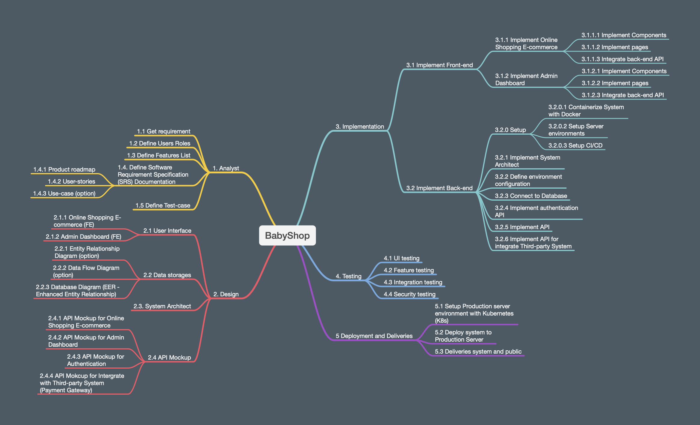

# Phase 01: Get requirement 

## 1 - Purpose

- Define requirement of project.
- Define goal of project
- Define software process

## 2 - List of Phase

Team use SCRUM process for this project.
The project board: https://github.com/users/ledamquangvinh/projects/1

## 3 - Define Requirement

We want to develop the e-commerce system for selling baby's toys such as cars, teddy bear ... The System have the functions:

* List of items in the system.
* Show detail information of items.
* User can register their information to join membership program.
* User can choose and purchase the items.
* User can search for specific item.
* Admin can manage the items' information.
* Admin can manage the orders of user.
* Admin can manage users' information.
* Admin can manage the information for the membership program such as create and manage voucher-code.
* Admin can create the report for selling and information of items.

That's all for the basic requirement!

After that, the team can brainstorm to define advance features such as connect to payment gateway, notification for admin when user create an order, ...

## 4 - Create project plan

* Create Project Plan document.
* Setup resource
    * Human resources
    * Financial resources
    * Device resources
    * Setup tools resource: JIRA, Github, Server,...

* Define goal of project 
* Planning for project
    * Get requirement
    * Analyst requirement
    * Design
        * Storage Design
        * UI Design
        * System Design
            * Achitecture system design
            * API Mockup design
            * Database Shcema design

            