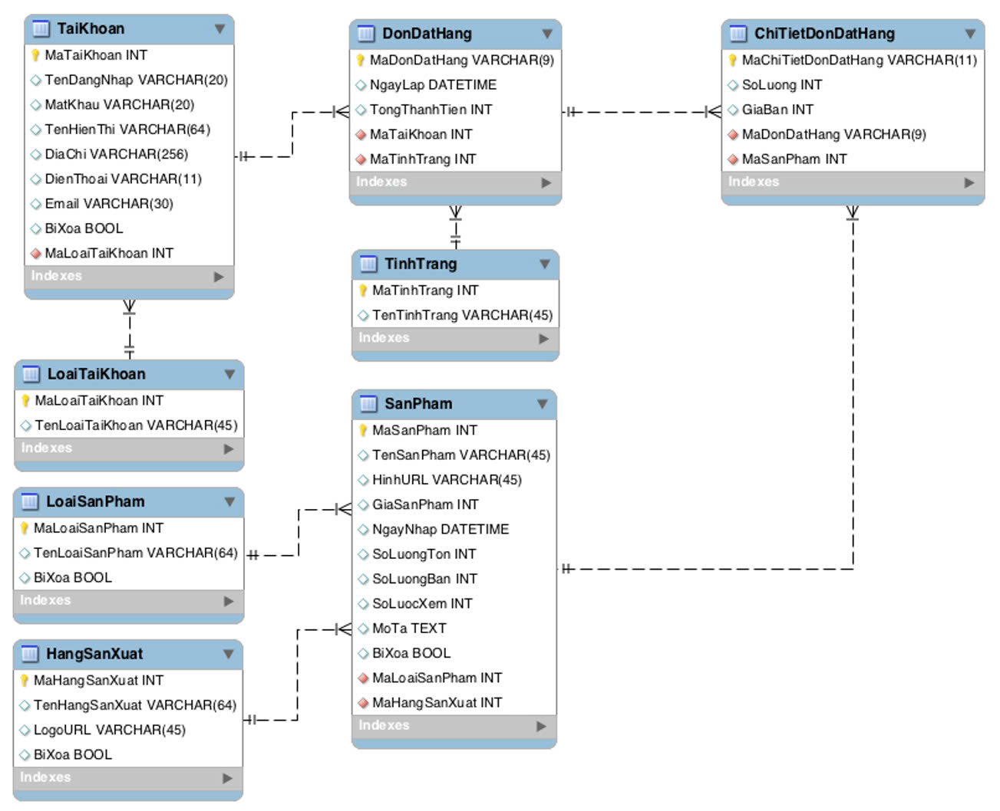

# Database Design

## 1 - Database Diagram

## 2 - Database Specification

### 2.1 - List of Tables

| No     | Table Name            | Description                                  |
| :----: | :-------------------- | :------------------------------------------- |
| 1      | loaitaikhoan          | Thong tin phan quyen cua tai khoan           |
| 2      | taikhoan              | Thong tin tai khoan                          |
| 3      | hangsanxuat           | Thong tin hang san xuat                      | 
| 4      | loaisanpham           | Danh muc san pham                            |
| 5      | sanpham               | Thong tin san pham                           |
| 6      | tinhtrang             | Tinh trang don hang                          |
| 7      | dondathang            | Thong tin don dat hang                       |
| 8      | chitietdonhang        | Thong tin chi tiet don dat hang              |              

## 2.2 - Table Structure

2.2.1 - Table: ***loaitaikhoan***
| No     | Field Name            | Data Type    | Key(PK/FK)    | Description                                   |
| :----: | :-------------------- | :----------: | :--------:    |:--------------------------------------------- |
| 1      | maloaitaikhoan        | INT          | PK            | Ma loai tai khoan                             |
| 2      | tenloaitaikhoan       | VARCHAR(45)  |               | Ten loai tai khoan                            |

2.2.2 - Table: ***taikhoan***
| No     | Field Name            | Data Type    | Key(PK/FK) | Description                                    |
| :----: | :-------------------- | :----------: | :--------: |:---------------------------------------------- |

2.2.3 - Table: ***hangsanxuat***
| No     | Field Name            | Data Type    | Key(PK/FK) | Description                                    |
| :----: | :-------------------- | :----------: | :--------: |:---------------------------------------------- |

2.2.4 - Table: ***loaisanpham***
| No     | Field Name            | Data Type    | Key(PK/FK) | Description                                    |
| :----: | :-------------------- | :----------: | :--------: |:---------------------------------------------- |

2.2.5 - Table: ***sanpham***
| No     | Field Name            | Data Type    | Key(PK/FK) | Description                                    |
| :----: | :-------------------- | :----------: | :--------: |:---------------------------------------------- |

2.2.6 - Table: ***tinhtrang**
| No     | Field Name            | Data Type    | Key(PK/FK) | Description                                    |
| :----: | :-------------------- | :----------: | :--------: |:---------------------------------------------- |

2.2.7 - Table: ***dondathang***
| No     | Field Name            | Data Type    | Key(PK/FK) | Description                                    |
| :----: | :-------------------- | :----------: | :--------: |:---------------------------------------------- |

2.2.8 - Table: ***chitietdonhang***
| No     | Field Name            | Data Type    | Key(PK/FK) | Description                                    |
| :----: | :-------------------- | :----------: | :--------: |:---------------------------------------------- |
