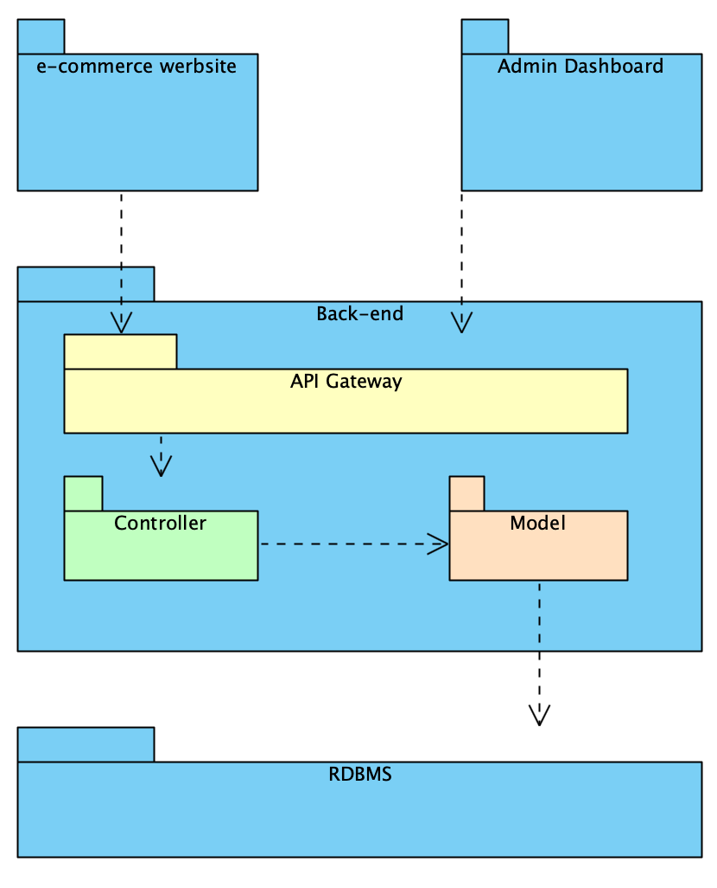

# Software Architecture Design

## 1 - Architecture Diagram

## 2 - Architecture Description

* ***e-commerce website*** is frontend for customer to buy product. It is built by ReactJS.

* ***admin dashboard*** is frontend for the admin and employee can manage the system. It is built by ReactJS.

* ***Backend*** is backend-system to access database and manage business logic of the system.
    * ***API Gateway*** manage the request from frontend direct to controller which will process the logic.
    * ***Controller*** process the logic of business.
    * ***Model*** manage the object which is loaded and access data from database.
* ***RDBMS*** is Relationship Database Management System